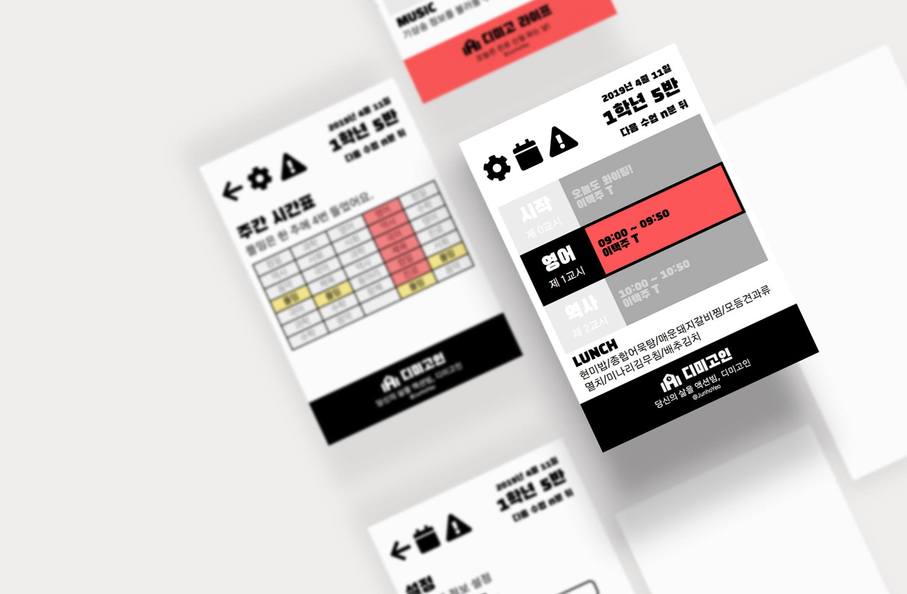

# Dimicigan-Chrome

> Chrome extension for checking timetable about each class in [Dimigo](https://dimigo.hs.kr)

> `설정`에서 정한 학년/반 정보를 이용해서 현재 시간에 맞는 `시간표 정보`를 가져옵니다.

> 화요일은 `잔류 신청`을 위해 하단 푸터에 디미고 라이프 탭을 여는 링크를 표시합니다.

> `주간 시간표`에서 학급의 일주일 시간표를 확인하고, 특정 과목이 언제 있는지를 쉽게 확인할 수 있습니다.
> 
> `알람` 기능 역시 지원할 예정입니다.

## 설치
 1. [최신 릴리즈](https://github.com/junhoyeo/Dimicigan-Chrome/releases)의 zip 파일을 다운로드 받아 압축을 풉니다.
 2. [chrome://extensions/](chrome://extensions/)로 이동합니다.
 3. 상단 오른쪽에 있는 `개발자 모드` 스위치를 켭니다.
 4. `압축해제된 확장 프로그램을 로드합니다.` 버튼을 누르고, 1에서 압축을 해제한 폴더(`index.html`이 존재하는 폴더)를 선택합니다.
 5. 이제 크롬 주소 표시줄 오른쪽에 생긴 아이콘을 이용해서 편리하게 시간표 정보를 확인할 수 있습니다.
