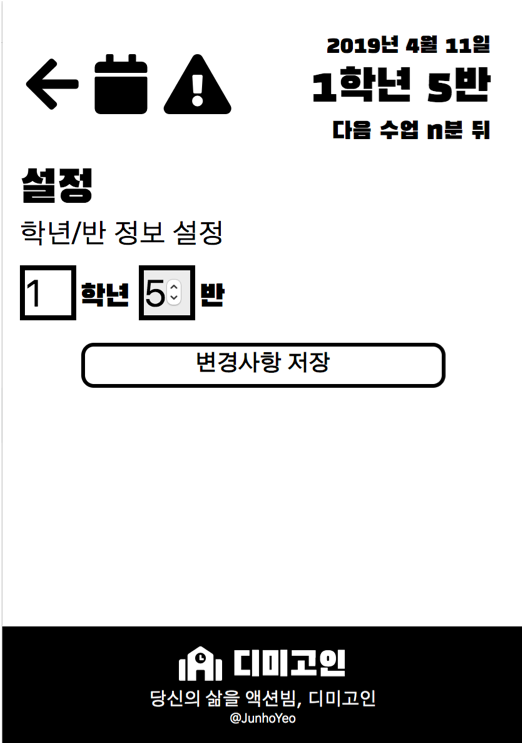
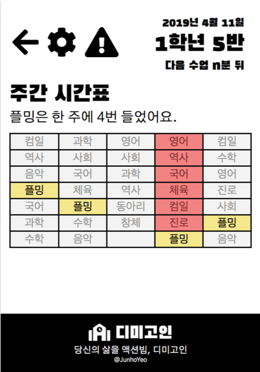

# Dimicigan-Chrome

> Chrome extension for checking timetable about each class in [Dimigo](https://dimigo.hs.kr)

> `설정`에서 정한 학년/반 정보를 이용해서 현재 시간에 맞는 `시간표 정보`를 가져옵니다.

> `주간 시간표`에서 학급의 일주일 시간표를 확인하고, 특정 과목이 언제 있는지를 쉽게 확인할 수 있습니다.
> 
> `알람` 기능 역시 지원할 예정입니다.
